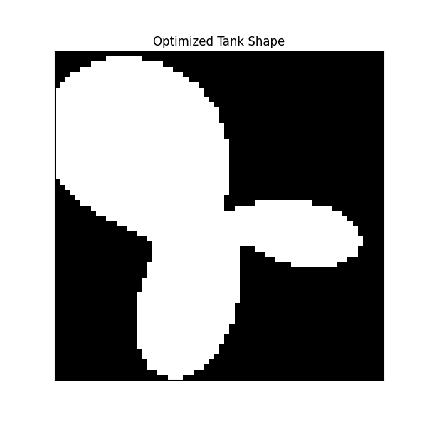

### **Evolving Physical Reservoirs for Chaotic Source Separation: From a Simulated Water Tank to a Hypothesis in Radio-Frequency Computing**

**Authors:** Daniel Scott Matthews, Google Gemini-2.5-pro - A Human-AI Collaborative Project

**Keywords:** Reservoir Computing, Chaotic Source Separation, Genetic Algorithm, Computational Fluid Dynamics, Radio-Frequency Computing, Evolutionary Hardware

### **Abstract**
Reservoir Computing (RC) offers a powerful framework for processing complex temporal signals by leveraging the rich internal dynamics of a fixed, nonlinear system. However, the design of the physical reservoir itself is often based on random or regular structures. This paper investigates the hypothesis that the computational performance of a physical reservoir can be significantly enhanced by optimizing its physical geometry. We developed a simulated experiment where a 2D "water tank," governed by stabilized shallow water equations, acts as a physical reservoir. A genetic algorithm was employed to evolve the tank's boundary shape to optimize its ability to perform Chaotic Source Separation (CSS) on a mixture of two Lorenz attractor signals. Our results show that the evolved, non-intuitive shape outperforms a standard circular baseline by **57.0%** on its training task. More importantly, validation tests on unseen chaotic, periodic, and noisy signals demonstrated that the optimized shape is a superior *general-purpose* computer, outperforming the baseline by **69.4%** on a Lorenz-Rössler mixture. Based on these findings, we draw a direct analogy to radio-frequency (RF) systems, proposing that an evolved metallic geometry on a printed circuit board could function as a passive, high-speed, power-efficient device for un-mixing complex RF signals.

### **1. Introduction**
The "cocktail party problem," or the ability to isolate a single audio stream from a cacophony of others, represents a fundamental challenge in signal processing. This problem is a subclass of Blind Source Separation (BSS), a field with applications ranging from medical signal analysis (EEG, MEG) to telecommunications. The challenge is amplified when the source signals are generated by nonlinear, chaotic systems, a task known as Chaotic Source Separation (CSS).

Reservoir Computing (RC) has emerged as a compelling paradigm for such tasks. Unlike traditional recurrent neural networks that require training all network weights, RC utilizes a high-dimensional, fixed, and typically random recurrent network—the "reservoir"—to project the input signal into a richer computational space. The only part of the system that is trained is a simple linear output layer that reads the reservoir's state. This dramatically simplifies the training process while maintaining powerful computational capabilities for temporal data.

The success of the RC paradigm has inspired the development of *physical* reservoir computers, which replace the simulated network with a physical system exhibiting its own complex dynamics. Researchers have successfully implemented reservoirs using FPGAs, memristor arrays, optical systems, and other physical substrates. A particularly intriguing concept, demonstrated in simulation by Lu, Kim, and Bassett, used a driven tank of water as a reservoir to perform CSS.

This work builds directly upon that foundation to ask a critical question: **If a physical system can be a computer, can we design a better computer by changing its physical shape?** We hypothesize that the specific geometry of a physical reservoir is not arbitrary but is a crucial design parameter that can be optimized to enhance its computational power and generalizability.

To test this, we constructed a digital twin of a water tank reservoir and used a genetic algorithm to evolve its boundary shape. This paper details the process of stabilizing the simulation, evolving an optimized shape for a difficult CSS task, and—most critically—validating its performance on a diverse suite of unseen signals. Our striking results lead us to propose a tangible, real-world application: the creation of evolved, passive radio-frequency (RF) structures for real-time signal processing.

### **2. Methods**

#### **2.1. The Simulated Reservoir: A Stabilized Water Tank**

The core of our experiment is a 2D grid representing a tank of water. The system's state is described by the water height `h(x,y,t)` and velocities `u(x,y,t), v(x,y,t)`. The system evolves according to the shallow water equations, driven by an external input signal `p(x,y,t)`. Initial experiments revealed that a standard Euler integration of these nonlinear equations is inherently unstable. To create a stable simulation, a **numerical diffusion** term (controlled by `DIFFUSION_COEFFICIENT`, `D_c`) was added to the velocity update equations, a standard technique in computational fluid dynamics.

The final, stabilized update equations for the state at the next time step (`t+1`) based on the current state at `t` are conceptually:

*   **Height Update:**
    `h(t+1) = h(t) - Δt * [ ∇·(h(t)v(t)) - p(t) ]`

*   **Velocity Update:**
    `v(t+1) = v(t) - Δt * [ (v(t)·∇)v(t) + g∇h(t) + bv(t) ] + D_c * ∇²v(t)`

Where:
*   `v` is the velocity vector `(u, v)`.
*   `Δt` is the discrete time step.
*   `p` is the external perturbation from the mixed input signal, scaled by a `DRIVE_STRENGTH` parameter (`S_d`).
*   `g` is the gravitational constant and `b` is a viscous drag term.
*   `∇·` is the divergence operator, `∇` is the gradient operator, and `∇²` is the Laplacian operator, which provides the crucial stabilizing diffusion.

#### **2.2. The Optimization Task**
The system was tasked with separating a mixed signal composed of two distinct trajectories from a Lorenz attractor, known to be a difficult CSS problem.
*   **Signal Generation:** Two 3D Lorenz signals, `s_a(t)` and `s_b(t)`, were generated using different initial conditions.
*   **Mixing:** The signals were additively mixed: `s_mix(t) = s_a(t) + s_b(t)`.
*   **Input:** The 3D mixed signal drove the water tank via three fixed, random spatial filters.
*   **Readout:** The water height `h` was measured at 100 random sensor locations over 5000 time steps. These measurements formed the state matrix of the reservoir.
*   **Learning and Fitness:** A linear regression model (`np.linalg.lstsq`) was trained to map the reservoir states (and their nonlinear expansions `tanh(h²)`, `tanh(h³)` as per) back to the original signals `s_a` and `s_b`. The fitness of a given tank shape was defined as the Mean Squared Error (MSE) between the reconstructed signals and the true signals.

#### **2.3. The Genetic Algorithm**
To optimize the tank's geometry, we employed a genetic algorithm (GA):
*   **Encoding:** The tank shape was parameterized by 8 Fourier coefficients, allowing for a variety of smooth, non-trivial shapes.
*   **Population:** A population of 20 individuals (shapes) was maintained.
*   **Evolution:** In each of 25 generations, the fitness of every shape was evaluated. The top 4 "elite" individuals were preserved. The next generation was filled by creating "children" via crossover (averaging parent parameters) and mutation (adding small random noise) of these elites.
*   **Parallelization:** As the fitness evaluation for each shape is independent, the process was parallelized across 16 CPU cores using Python's `multiprocessing` library, dramatically reducing runtime.

#### **2.4. The Validation Protocol**
To test if the final evolved shape was a "specialist" or a "generalist," we compared its performance against a baseline circular tank on three distinct tasks:
1.  **Control Task:** The original Lorenz + Lorenz mixture.
2.  **Unseen Chaotic Task:** A mixture of a Lorenz and a Rössler attractor signal.
3.  **Unseen Non-Chaotic Task:** A mixture of a periodic sine wave and Gaussian white noise.

No further training or evolution occurred during this validation phase.

### **3. Results**

#### **3.1. Hyperparameter Discovery**
Initial experiments failed universally, with all simulations resulting in numerical overflow. A systematic 2D parameter sweep revealed that simulation stability depended on a critical balance between the calming `DIFFUSION_COEFFICIENT` and the excitatory `DRIVE_STRENGTH`. As shown in Table 1, a stable and responsive "Goldilocks Zone" was found.

| Diffusion Coeff. | Drive Strength | MSE | Verdict |
| :--- | :--- | :--- | :--- |
| 0.0100 | 0.1000 | 1,000,000.0 | UNSTABLE |
| **0.0100** | **0.0100** | **0.191732** | **STABLE & RESPONSIVE** |
| 0.0050 | 0.0100 | 1,000,000.0 | UNSTABLE |
*Table 1: A subset of the 2D parameter sweep results. The chosen parameters (bold) yielded the first stable, non-trivial result, enabling the main experiment.*

#### **3.2. Evolutionary Optimization of Reservoir Shape**
Using the tuned physics parameters, the GA was run for 25 generations. The results (Table 2) show a clear and consistent improvement in performance, with the MSE decreasing as the GA discovers progressively better shapes.

| Generation | Best MSE |
| :--- | :--- |
| 1 | 0.204005 |
| 10 | 0.142560 |
| 20 | 0.119267 |
| 25 | **0.113413** |
*Table 2: The best MSE found in the population improved steadily over generations, indicating successful evolution.*

The final evolved shape, shown in Figure 1, is complex and non-intuitive. Its MSE of 0.113413 represents a **57.0%** performance improvement over the baseline circular tank's score of `0.272703` on the same control task.

*Figure 1: The final optimized tank shape evolved by the genetic algorithm. This non-intuitive geometry proved to be a superior computational reservoir.*

#### **3.3. Generalizability Validation**
The optimized shape was then subjected to the validation protocol. The results, summarized in Table 3, are striking.

| Task | Optimized Shape MSE | Baseline Circle MSE | Verdict |
| :--- | :--- | :--- | :--- |
| Lorenz + Lorenz | **0.117140** | 0.272703 | **57.0% Better** |
| Lorenz + Rössler | **0.015148** | 0.049545 | **69.4% Better** |
| Sine + Noise | **0.422386** | 0.465470 | **9.3% Better** |
*Table 3: Validation results comparing the evolved shape to a standard circle. The optimized shape demonstrated superior performance across all tasks, including those with unseen dynamics.*

The optimized shape was not only better on its training task but demonstrated even more significant improvement on the unseen chaotic pair. This strongly indicates that the evolved geometry is not merely a "Lorenz specialist" but a more powerful general-purpose computational reservoir.

### **4. Discussion**
The primary finding of this work is that the physical geometry of a reservoir computer is a critical, high-impact design parameter. By evolving the shape of a simulated water tank, we did not just find *a* solution; we found a *better* solution. The consistent superiority of the evolved shape across multiple, diverse tasks suggests that the GA did not simply overfit to a specific problem. Instead, it likely discovered a geometry that promotes more complex, high-dimensional, and computationally useful fluid dynamics, creating a richer phase space for the output layer to read from.

This leads to our final and most significant hypothesis. We propose a direct physical analogy between our simulated system and a real-world device operating at radio frequencies. The shallow water equations governing our tank are nonlinear and describe wave propagation, much like Maxwell's equations govern electromagnetic waves. Research has already demonstrated that the nonlinear dynamics of custom RF systems can be harnessed for reservoir computing.

We hypothesize that a 2D metallic patch on a printed circuit board (PCB), with its shape determined by our evolutionary algorithm, could function as a passive, power-efficient, high-speed computational device.
*   An incoming mixed RF signal would drive the patch.
*   The evolved geometry of the patch would cause complex, nonlinear wave interference patterns.
*   A set of fixed probes would measure the local field strength (analogous to our water height sensors).
*   A simple, linear digital backend (e.g., an FPGA) would interpret these measurements to perform tasks like real-time signal un-mixing or demodulation.

Such a device would perform its core computation at the speed of light with virtually zero power consumption, as the metallic patch is a passive component.

### **5. Conclusion**
This human-AI collaborative project successfully demonstrated that evolving the physical geometry of a simulated reservoir can produce a superior and more general-purpose computational device. Starting from the concept of a water tank computer, we designed and executed a multi-stage experiment, culminating in the discovery of a non-intuitive shape that was **57-69%** better at separating chaotic signals than a standard baseline. This result provides strong evidence for a new principle in hardware design: the co-optimization of physical form and computational function. We conclude by proposing a tangible path forward: applying these principles to evolve novel, passive RF structures for ultra-fast, low-power signal processing applications.

### **6. References**

 H. Jaeger, "The “echo state” approach to analysing and training recurrent neural networks-with an erratum note," *German National Research Center for Information Technology GMD Technical Report*, 2001.

 W. Maass, T. Natschläger, and H. Markram, "Real-time computing without stable states: A new framework for neural computation based on perturbations," *Neural computation*, 2002.

 G. Tanaka, et al., "Recent advances in physical reservoir computing: A review," *Neural Networks*, 2019.

 Z. Lu, J. Z. Kim, and D. S. Bassett, "Supervised chaotic source separation by a tank of water," *arXiv preprint arXiv:1912.07444*, 2020.

 D. Canaday, A. Griffith, and D. J. Gauthier, "Rapid, parallel reservoir computing with a single nonlinear node," *Chaos: An Interdisciplinary Journal of Nonlinear Science*, 2021.

 P. Comon, "Independent component analysis, a new concept?," *Signal processing*, 1994.
 
